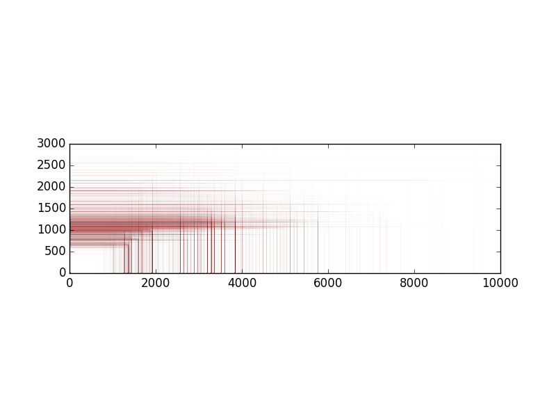

= Visualize screensizes

A little experiement I wrote a late night inspired by this link:https://plus.google.com/+LukeWroblewski/posts/jTLBeNUdPHG?pid=6146550866503083634&oid=100817211548713875249&authkey=CKCb-dPOxc-wZA[Post].

It runs through a comma separated file (currently hardcoded to `sizes.csv`) in the following format:

```
height,width,frequency
```

The link:sizes.csv[] is a sample of data from JBoss Tools
detected screen sizes the last 30 days up to May 9th 2015.

All extracted from standard Google Analytics screen size data.

The result looks like this:



== How to install/run

It requires Python and uses matplotlib.

  `pip install matplotlib`

Once installed run:

  `python render.py`


